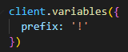

# $getPrefixVar

## Usage

```php
$getPrefixVar
```

## Example

```javascript
client.command({
  name: "prefix",
  code: `
  Current prefix is: $getPrefixVar
  ` // Will return, for example, '!'
})
```

#### Note: You'll need to add variable 'prefix' to your code before using this function to avoid errors!

<div align="left" data-full-width="true">

<figure><figcaption></figcaption></figure>

</div>
