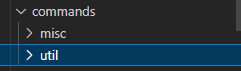

# Command handler

## What's a command handler?

A command handler allows you to have a more organized main file.

When you use your main file to store commands, it's ok, but after creating a few commands, it's quite hard to find and update those commands, isn't it? On that case, you should consider use a **Command Handler** wich will allow you to store your commands in a more organized way and keeping your main file away from a code disaster.

## Setup

### Step 1 - Initialize a new command loader on your main file:


```javascript
const oxi = require("oxi.js");

const client = new oxi.Client({
    token: "Your token",
    prefix: "Your prefix",
    intents: ["GUILDS", "GUILD_MESSAGES"]
});

client.onMessage();
const loader = new oxi.LoadCommands(client);
loader.load(client.cmd, './commands/') // 'commands' can be changed to any other folder that you want
```


### Step 2 - Create your commands folder

You should go to your project, and, into your root folder you should create a folder named just like the folder name you established before in your index, in this case, the folder name should be **'commands'**

<figure><figcaption></figcaption></figure>

### Step 3 - Create another folder inside your 'commands' folder

This folder will contain all your commands, you can create any as you want!

<figure><figcaption></figcaption></figure>

### Step 4 - Create a file ended in .js extension

That file will contain your file's code

#### Command example


```javascript
// fileName.js
module.exports = {
  name: "Command Name",
  aliases: ["Command Aliases"], // You can leave this empty
  code: `
  Hello, world!
  `
}
```


You can also have 2 or more commands in same file like this:


```javascript
module.exports = [{
  name: "command1",
  aliases: ["Command Aliases"], // You can leave this empty
  code: `
  Hello, world!
  `
},{
  name: "command2",
  aliases: ["cmd2"],
  code: `
  This is a command example!
  `
}]
```

